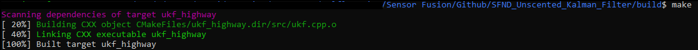
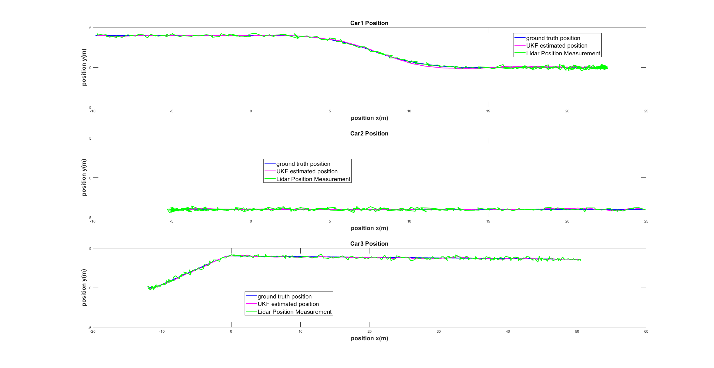
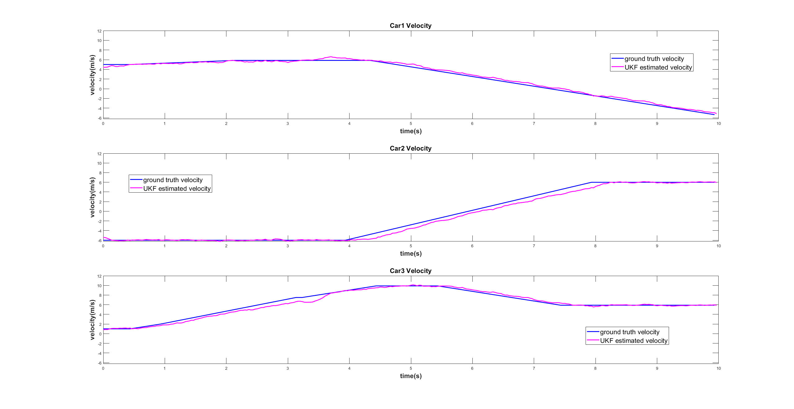
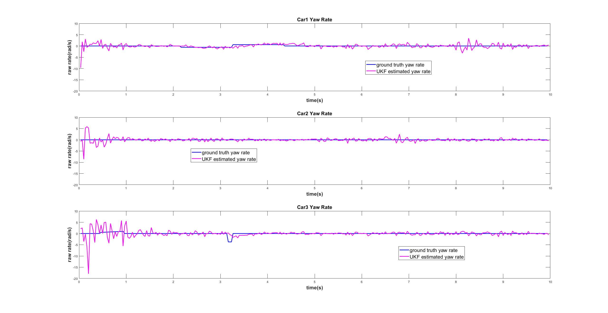
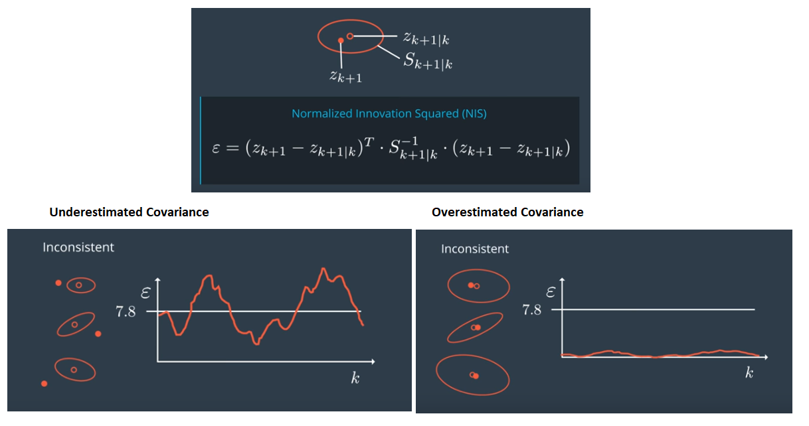
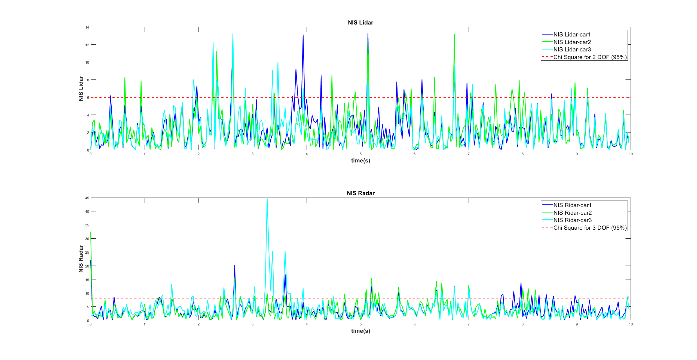

# SFND_Unscented_Kalman_Filter
Sensor Fusion UKF Highway Project Starter Code

In this project you will implement an Unscented Kalman Filter to estimate the state of multiple cars on a highway using noisy lidar and radar measurements. Passing the project requires obtaining RMSE values that are lower that the tolerance outlined in the project rubric. 

The main program can be built and ran by doing the following from the project top directory.

1. mkdir build
2. cd build
3. cmake ..
4. make
5. ./ukf_highway

Note that the programs that need to be written to accomplish the project are src/ukf.cpp, and src/ukf.h

The program main.cpp has already been filled out, but feel free to modify it.

`main.cpp` is using `highway.h` to create a straight 3 lane highway environment with 3 traffic cars and the main ego car at the center. 
The viewer scene is centered around the ego car and the coordinate system is relative to the ego car as well. The ego car is green while the 
other traffic cars are blue. The traffic cars will be accelerating and altering their steering to change lanes. Each of the traffic car's has
it's own UKF object generated for it, and will update each indidual one during every time step. 

The red spheres above cars represent the (x,y) lidar detection and the purple lines show the radar measurements with the velocity magnitude along the detected angle. The Z axis is not taken into account for tracking, so you are only tracking along the X/Y axis.

---

## Other Important Dependencies
* cmake >= 3.5
  * All OSes: [click here for installation instructions](https://cmake.org/install/)
* make >= 4.1 (Linux, Mac), 3.81 (Windows)
  * Linux: make is installed by default on most Linux distros
  * Mac: [install Xcode command line tools to get make](https://developer.apple.com/xcode/features/)
  * Windows: [Click here for installation instructions](http://gnuwin32.sourceforge.net/packages/make.htm)
* gcc/g++ >= 5.4
  * Linux: gcc / g++ is installed by default on most Linux distros
  * Mac: same deal as make - [install Xcode command line tools](https://developer.apple.com/xcode/features/)
  * Windows: recommend using [MinGW](http://www.mingw.org/)
 * PCL 1.2

## Basic Build Instructions

1. Clone this repo.
2. Make a build directory: `mkdir build && cd build`
3. Compile: `cmake .. && make`
4. Run it: `./ukf_highway`

## Editor Settings

We've purposefully kept editor configuration files out of this repo in order to
keep it as simple and environment agnostic as possible. However, we recommend
using the following settings:

* indent using spaces
* set tab width to 2 spaces (keeps the matrices in source code aligned)

## Code Style

Please stick to [Google's C++ style guide](https://google.github.io/styleguide/cppguide.html) as much as possible.

## Generating Additional Data

This is optional!

If you'd like to generate your own radar and lidar modify the code in `highway.h` to alter the cars. Also check out `tools.cpp` to
change how measurements are taken, for instance lidar markers could be the (x,y) center of bounding boxes by scanning the PCD environment
and performing clustering. This is similar to what was done in Sensor Fusion Lidar Obstacle Detection.

## Project Instructions and Rubric

This information is only accessible by people who are already enrolled in Sensor Fusion. 
If you are enrolled, see the project page in the classroom
for instructions and the project rubric.

## Writeup - Final Report
##  Compiling and Testing
_The submission must compile._

The screen shot below shows the project code is compiled without errors using cmake and make.   
   

##  Code Efficiency
_The methods in the code should avoid unnecessary calculations._

 My code doesn't sacrifice comprehension, stability, or robustness for speed. I also maintained good and efficient coding practices when writing UKF functions.

 ##  Accuracy
_px, py, vx, vy output coordinates must have an RMSE <= [0.30, 0.16, 0.95, 0.70] after running for longer than 1 second._  

Below GIF file is my final project output based on data provided by the code. As you can see, it passes the RMSE accuracy requirement. 

### Evaluation of UKF Estimated Positions
I've made a comparison among ground truth positions, Lidar measured position and UKF estimated positions for 3 traffic cars to evaluate my UKF implemented algorith and code. As you can see, the graph below demonstrates the result from implemented UKF code. 

### Evaluation of UKF Estimated Velocity
The graph below shows a comparison between ground truth velocity and UKF estimated velocity for 3 traffic cars.

### Evaluation of UKF Estimated Yaw Rate
The graph below also shows a comparison between ground truth yaw rate and UKF estimated yaw rate for 3 traffic cars.

### NIS - Normalized Innovation Squared

The NIS definition from the course is illustrated below.

The final NIS evaluation for Lidar and Radar measurement noise covariance from the code is shown as below

##  Follows the Correct Algorithm
My UKF algorithm follows the general processing flow as taught in the preceding lessons. You can find how I implenmented it in `ukf.cpp`

## Other Discussion

I believe the code provided by Udacity has errors in regarding the radar sense measurement in function of _`rmarker Tools::radarSense(Car& car, Car ego, pcl::visualization::PCLVisualizer::Ptr& viewer, long long timestamp, bool visualize)`_ from `tools.cpp`

The radar measurement - rho, phi and rho_dot are relative measurements to the ego car. We need to convert them in global coordinates when we pass them to `ukf.ProcessMeasurement(meas_package)`. Below is what I added in the `Tools::radarSense` function. 

	//XC: convert from relative coordinates to absolute coordiates
	double x = ego.position.x+marker.rho*cos(marker.phi);
	double y = ego.position.y+marker.rho*sin(marker.phi);
	double vx = ego.velocity * cos(ego.angle) + marker.rho_dot * cos(marker.phi);
	double vy = ego.velocity * sin(ego.angle) + marker.rho_dot * sin(marker.phi);
	marker.rho = sqrt(x*x + y*y);
	marker.phi = atan2(y, x);
	marker.rho_dot = (x*vx + y*vy)/marker.rho;
	// conversion end

Another error is rho_dot definition in the Udacity's provided code. It should be relative to the ego car. I corrected it.

	// double rho_dot = (car.velocity*cos(car.angle)*rho*cos(phi) + car.velocity*sin(car.angle)*rho*sin(phi))/rho;
	// XC: I believe the above rho_dot from udacity is incorrect. rho_dot should be relative to the ego car as rho and phi do.
	double rho_dot = ((car.velocity*cos(car.angle) - ego.velocity*cos(ego.angle))*rho*cos(phi) + (car.velocity*sin(car.angle) - ego.velocity*sin(ego.angle))*rho*sin(phi))/rho;

